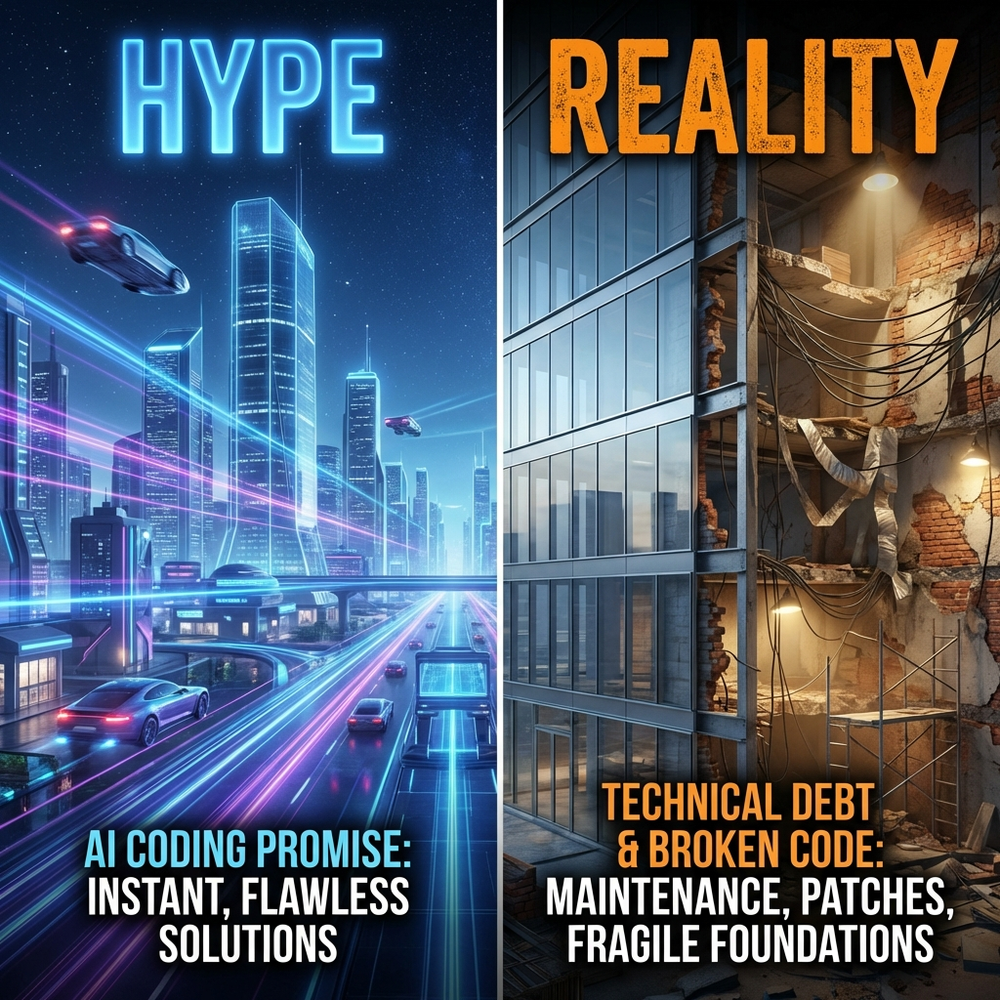
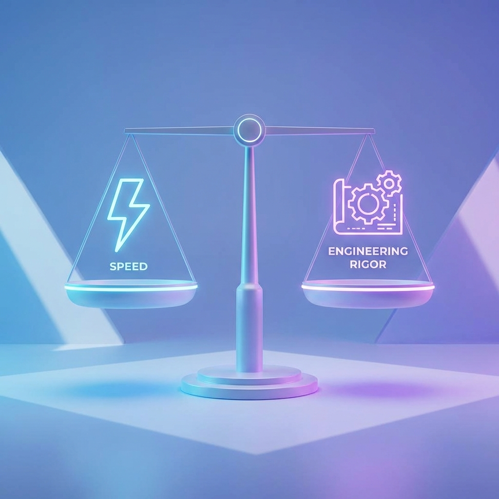
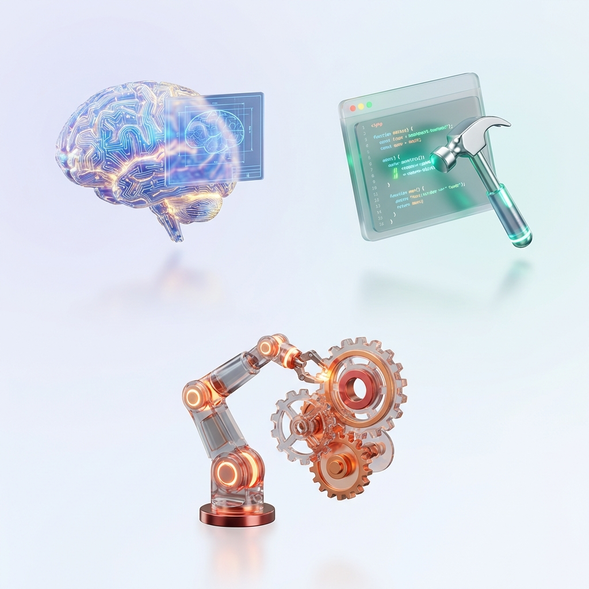
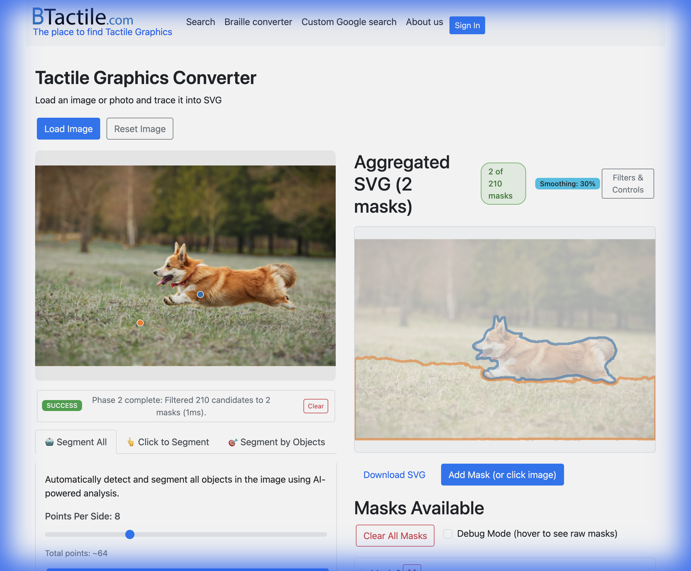
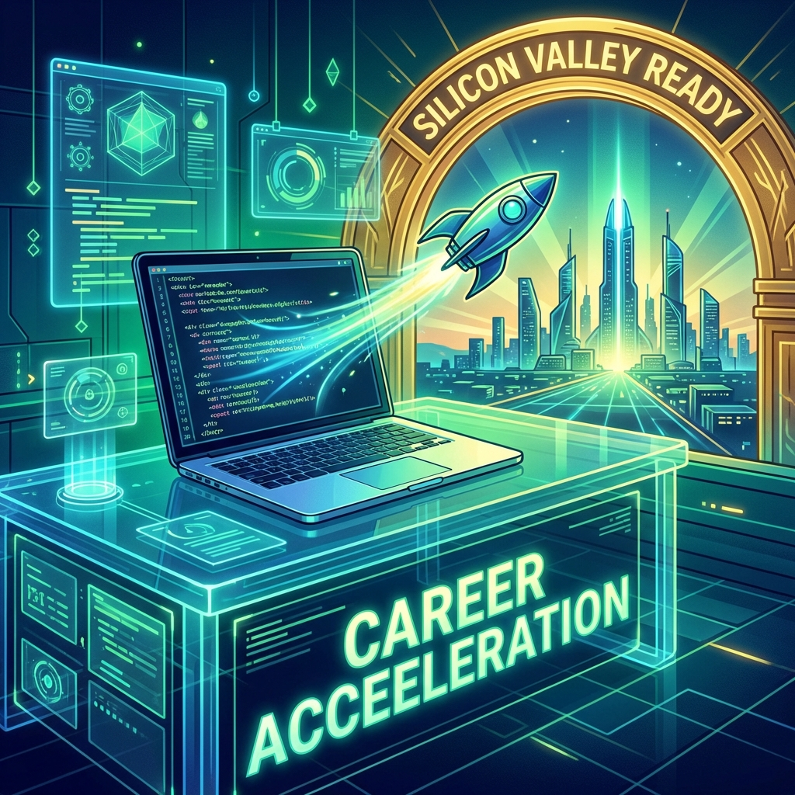

# CS 7180: Special Topics in AI

## Vibe Coding

### AI-Assisted Software Engineering

---

# Your Instructor

**John Alexis Guerra Gomez**
Associate Teaching Professor
Khoury College of Computer Sciences

📧 jguerra@northeastern.edu
🕐 Office Hours: By appointment via Slack

---

# Course Logistics

**Schedule:** Tuesday/Thursday 3:00-4:40 PM PST
**Location:** Lucie Stern 27 for Oakland Campus Students / Remote for the rest of the Network
**Semester:** Spring 2026

**Communication:** Slack (primary), Canvas (submissions)

---

# What is "Vibe Coding"?

> "You see something, say something, run it, and then fix it based on vibes."
> — Andrej Karpathy

The idea that you can build software by _describing what you want_ to an AI and iterating on the results.

---

# The Vibe Coding Hype

✅ Build apps in minutes
✅ No need to understand code
✅ "Anyone can be a developer"
✅ 10x productivity gains

**Sounds amazing, right?**

<small title="Prompt: A split composition comparing 'Hype' vs 'Reality' in software development. Left side (Hype): A futuristic, glowing, perfect cyber-city with clear skies and flying cars, representing the promise of AI coding. Right side (Reality): A construction site with a beautiful modern facade but crumbling, messy bricks and duct tape behind it, representing technical debt and broken code. High quality 3D render style, cinematic lighting.">_Image generated with Nano Banana_ ℹ️</small>

---

# The Vibe Coding Reality

😬 Code that works... until it doesn't
😬 Technical debt accumulates fast
😬 Hallucinations go undetected
😬 Security vulnerabilities everywhere
😬 "It works on my machine"

---

# The Problem with "Crazy" Vibe Coding

- No tests → bugs ship to production
- No understanding → can't debug
- No CI/CD → manual, error-prone deploys
- No code review → quality varies wildly
- No evals → how do you know it's good?

---

# This Course: A Different Approach

## Vibe Coding + Software Engineering

Build fast **AND** build right.

---

# Our Philosophy

| Crazy Vibe Coding         | This Course                                      |
| ------------------------- | ------------------------------------------------ |
| Prompt and pray           | Analyze, Plan, Prompt, Test, Validate with users |
| Ship it and forget        | CI/CD pipelines                                  |
| Trust the AI blindly      | Evaluate systematically                          |
| Code you don't understand | Code you can explain                             |

<small title="Prompt: A conceptual 3D illustration of a balanced scale. On one side of the scale is a glowing icon representing 'Speed' (like a lightning bolt). On the other side is an icon representing 'Engineering Rigor' (like a gear or blueprint). The scale is perfectly balanced. Minimalist, modern, clean aesthetic, soft blue and purple lighting.">_Image generated with Nano Banana_ ℹ️</small>

---

# What You'll Learn

- **LLM Fundamentals** — How AI really works
- **Three AI Modalities** — Right tool for the job
- **Prompt Engineering** — Get better outputs
- **Context Engineering** - Help the AI understand your codebase
- **Test-Driven Development** — Tests before code
- **CI/CD Pipelines** — Automated quality
- **Evals** — Measure AI code quality

---

# The Three AI Modalities

How we'll structure our AI-assisted development:

1. **Claude Web** — Quick projects / Ideation
2. **Antigravity** — Integrating AI into your classical workflow
3. **Claude Code** — AI First Development

<small title="Prompt: A set of 3 matching high-quality 3D icons on a clean background, representing three AI coding modalities. 1. A digital brain or glowing blueprint (representing Architecture/Thinking). 2. A floating coding editor window with a hammer/tool (representing Building/Dev). 3. A robot arm interacting with gears (representing Automation/Ops). Modern, sleek, glassmorphism style.">_Image generated with Nano Banana_ ℹ️</small>

---

# Modality 1: Claude Web

**Best for:** Architecture, learning, brainstorming

- Conversational coding
- Claude Projects for context
- Artifacts for prototypes
- Complex problem-solving

_Use when you need to think through a problem_

---

# Modality 2: AI-Augmented Editor

**Best for:** Production code, daily workflow

- Tab autocomplete
- Inline chat (Cmd+K)
- Composer for multi-file changes
- .gemini/workflows for consistency

_Keep your classical workflow get AI help._

<small title="Prompt: A conceptual 3D illustration of an AI-augmented code editor. A high-tech monitor screen displays colorful code syntax. A translucent, glowing 'ghost text' suggestion extends from the cursor, representing AI autocomplete. Soft, intelligent lighting (teal and purple) flows from the screen, suggesting collaboration between the human developer and the AI. Modern, sleek, dark mode aesthetic.">_Image generated with Nano Banana_ ℹ️</small>

---

# Modality 3: Claude Code

**Best for:** Automation, refactoring, DevOps

- Terminal-based workflows
- Autonomous multi-file changes
- Script automation
- Complex migrations

_Use when you need to change many files_

---

# Knowing Which Tool to Use

| Task                             | Modality                |
| -------------------------------- | ----------------------- |
| Project ideation                 | Claude Web              |
| Image generation or manipulation | Nano Bananna (Gemini)   |
| Generate test cases              | Claude Code             |
| Create a quick page to share     | Gemini (better sharing) |

---

# Some examples

## My nephews' games

- My nephews were bored.
- Instead of giving them a tablet, I helped them build games.
- Their favorite topics
- From my phone
- Gemini Web

---

# BTactile SVG Converter

**[btactile.com/toSVG](https://btactile.com/toSVG)**

- **AI-Powered Tracing**: Uses SAM to auto-detect objects
- **Tactile Graphics**: Converts images to optimized SVGs for embossers
- **Interactive Controls**: "Segment All" & "Click" modes with density control
- **Browser-Based**: Client-side processing for privacy

---

# Family Board Game

**[johnguerra.co/viz/YoNoFui/](https://johnguerra.co/viz/YoNoFui/)**

- **Interactive Deduction Board**: Map of the house to find clues
- **Game Management**: Digital dice, clue revealer, and accusation system
- **Suspect Matrix**: Filter suspects by traits (glasses, hair, etc.)
- **Hybrid Play**: Digital companion for a physical board game

---

# Assessment Overview

| Component     | Weight |
| ------------- | ------ |
| Participation | 20%    |
| Homeworks (6) | 25%    |
| Project 1     | 15%    |
| Project 2     | 20%    |
| Project 3     | 20%    |

---

# Participation (20%)

**Pre-class questions (10%)**

- Submit a smart question before each class
- Answer 2 peer questions

**Lottery (10%)**

- Random cold-calling
- Tests engagement and understanding

---

# The Three Projects

You will build **3 portfolio-worthy applications**:

1. **Personal Utility App** (Week 6)
2. **Full-Stack Application** (Week 11)
3. **Team Application** (Week 15)

---

# Project 1: Personal Utility App

**Due Week 6 • 15%**

- Solve a real problem (validated!)
- 5+ user stories with CRUD
- ONE primary modality
- 50%+ test coverage
- CI/CD pipeline
- Deployed & accessible

---

# Project 2: Full-Stack Application

**Due Week 11 • 20%**

- Frontend + Backend + Database
- User authentication
- ALL 3 modalities
- 80%+ test coverage (TDD)
- Comprehensive evals
- 2+ Agile sprints

---

# Project 3: Team Application

**Due Week 15 • 20%**

- Team of 2-3
- Parallel agentic programming
- Enterprise CI/CD
- Production monitoring
- Security audit
- 3+ sprints

---

# The No-AI Challenge

## Week 10: Midterm Exam

90 minutes. No AI tools. Just you and the code.

**Must score 60%+ to pass.**

This ensures you _actually understand_ what you're building.

<small title="Prompt: A dramatic, moody illustration of a software developer working at a desk with NO computer screen, just pen and paper or a very basic old-school terminal. A 'No AI' symbol (circle with line through it over a robot) is subtly integrated into the background. Focus on deep concentration and human intellect. Cinematic lighting.">_Image generated with Nano Banana_ ℹ️</small>

---

# Why the No-AI Challenge?

If you can't code without AI, you can't:

- Debug AI-generated code
- Know when AI is wrong
- Pass technical interviews
- Be trusted with production systems

**AI assists. It doesn't replace understanding.**

---

# Homework Assignments

6 assignments building toward projects:

1. Mom Test Interviews + User Stories
2. Prompt Engineering Battle
3. Context Engineering Lab
4. TDD + CI/CD + Evals Suite
5. Parallel Agent Orchestration
6. Production Readiness Checklist

---

# Recommended Tools

**Paid (~$20/month):**

- Antigravity (Or cursor $20/month)
- Claude Code ($20-$200/month)

---

# Tech Stack

**Languages:** JavaScript, TypeScript

**Frontend:** React, Next.js, TailwindCSS
**Backend:** Node.js, Express
**Database:** PostgreSQL or MongoDB or Sqlite
**Testing:** Jest/Vitest, Playwright
**CI/CD:** GitHub Actions

---

# Required Books

1. **The Mom Test** — Rob Fitzpatrick
   _How to validate ideas_

2. **Designing for Growth** — Liedtka & Ogilvie
   _Design thinking toolkit_

3. **Scrum** — Jeff Sutherland
   _Agile methodology_

---

# Academic Integrity

This course **REQUIRES** AI tool use.

But:

- Document all AI usage
- Understand all code you submit
- Never commit code you can't explain
- Pass the No-AI Challenge

---

# What You'll Have by the End

📱 **3 production-ready apps**
💼 **Professional GitHub profile**
✍️ **Technical blog posts**
🎥 **Demo videos**
🧠 **Real understanding of AI + Engineering**

---

# Silicon Valley Ready

This course teaches **how software gets built in 2026**.

Not theoretical concepts.
Not outdated practices.

**Real tools. Real workflows. Real skills.**

<small title="Prompt: A futuristic, inspiring illustration of a 'launchpad' or high-tech workspace. A laptop displays code that is transforming into a rocket ship taking off towards a bright future. Represents being 'Silicon Valley Ready' and career acceleration. Vibrant colors, optimistic technological aesthetic.">_Image generated with Nano Banana_ ℹ️</small>

---

# Course Communication

**Slack** — Questions, discussions, resources
**Canvas** — Submissions, grades, quizzes
**Office Hours** — By appointment via Slack

Don't wait until the deadline to ask for help.

---

# Questions?

**Next up:** LLM Fundamentals

_Understanding how the AI actually works before we use it._

---

# Let's Build Something Amazing 🚀

Welcome to CS 7180.
