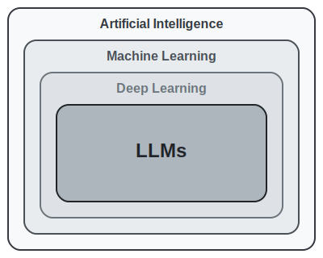

<!-- .slide: id="title" -->

## CS 7180: LLM Fundamentals


[**John Alexis Guerra Gómez**](http://johnguerra.co/)

jguerra at northeastern.edu

Class: [johnguerra.co/classes/aiCoding_spring_2026](https://johnguerra.co/classes/aiCoding_spring_2026/)

Slides: [johnguerra.co/lectures/ai_assisted_coding](http://johnguerra.co/lectures/ai_assisted_coding/02_LLMs_fundamentals/)

---

# How to Use GenAI Effectively

---

## Validation & Instructions

- You can quickly validate the output
  - You know the answer
  - Read everything it does
- You help it succeed by giving it clear instructions
  - Make it harder for it to hallucinate
  - Don't please me
- Provide enough context
- Ethical Use

---

# What We'll Cover Today

1. Neural Network Foundations (quick refresher)
2. LLM Training: "Sophisticated Autocomplete"
3. Tokens, Temperature, and Probability
4. Knowledge in Weights & The Bias Problem
5. Embeddings and Semantic Space
6. Context Windows & How Chatbots Work
7. RAG and Context Files
8. Hallucinations: Why AI Lies Confidently
9. The "Lazy Teenager" Mental Model

---

# What's AI anyways?

---

## AI vs. Machine Learning

- **Artificial Intelligence (AI)**: The broad field of creating systems that mimic human intelligence (logic, reasoning, perception).
- **Machine Learning (ML)**: A subset of AI where algorithms improve automatically through experience and data, rather than explicit programming.

---

## Where LLMs Fit In

- **Deep Learning**: A subset of ML using multi-layered neural networks (the "brain" of modern AI).
- **Large Language Models (LLMs)**: A specific application of Deep Learning trained on massive text datasets to understand and generate human language.
- **The Hierarchy**: AI ⊃ Machine Learning ⊃ Deep Learning ⊃ LLMs.



---

## Software Evolution by Karpathy

> "The hottest new programming language is English."
> — Andrej Karpathy

Watch: [Software Is Changing (Again)](https://www.youtube.com/watch?v=LCEmiRjPEtQ)

---

## Software 1.0: Explicit Instructions

**Traditional Programming (1950s-present)**

- Developers write explicit code (C++, Python, Java)
- Every behavior is designed, debugged, maintained by humans
- Clear, deterministic: input → algorithm → output

```python
def add(a, b):
    return a + b  # Human writes EVERY instruction
```

---

## Software 2.0: Neural Networks

**Machine Learning Era (2010s-present)**

- Instead of hand-coding rules, specify objectives + provide data
- The "code" is learned weights in neural networks
- Karpathy coined this in 2017

| Software 1.0   | Software 2.0        |
| -------------- | ------------------- |
| Write rules    | Train on data       |
| Explicit logic | Learned patterns    |
| GitHub repos   | Hugging Face models |

---

## Software 3.0: LLMs as Computers

**Natural Language Programming (2022-present)**

- LLMs are programmable via human language
- Prompts ARE the new code
- The model "executes" your English instructions

```
Software 1.0: Tell machine HOW to do it
Software 2.0: Show machine WHAT to do (examples)
Software 3.0: Tell machine WHAT you want (English)
```

---

## LLMs as Operating Systems

Karpathy's analogy: LLMs are emerging as new OS

| Traditional OS | LLM "OS"                 |
| -------------- | ------------------------ |
| CPU            | Reasoning capabilities   |
| RAM            | Context window           |
| File system    | Knowledge (RAG, weights) |
| Programs       | Prompts                  |

We're in the "mainframe era" — expensive, centralized, time-shared access via terminals (chat interfaces).

---

## The Recursive Loop

**Software eating software eating software:**

- Software 3.0 (LLM) can generate Software 1.0 (code)
- Software 3.0 can configure Software 2.0 (ML models)
- Each layer subsumes the previous

This is why we're learning **all three modalities** in this course!

---

# Why Understand LLMs?

> "If you can't explain why the AI gave that answer, you can't debug it when it's wrong."

- Debug AI-generated code effectively
- Know when to trust vs. verify
- Set realistic expectations
- Choose the right tool for the job

---

# Neural Networks: The 30-Second Version

- Inspired by biological neurons (loosely)
- Inputs → weighted connections → outputs
- Learning = adjusting weights to reduce error
- Stacked layers = "deep" learning

<!-- TODO: add image neural-network-basics.png -->

---

# Training: Adjusting Weights

1. Make a prediction
2. Compare to correct answer (error/loss)
3. Adjust weights to reduce error
4. Repeat millions of times

> "Training is like tuning millions of knobs until the output matches what you want."

---

# Gradient Descent: Finding the Bottom

- Imagine a hilly landscape (error surface)
- You're blindfolded, trying to find the lowest point
- Feel the slope under your feet
- Take small steps downhill
- Eventually reach a valley (minimum error)

<!-- TODO: add image gradient-descent.png -->

---

# From Simple to Sophisticated

| Model     | Parameters    | Comparison                 |
| --------- | ------------- | -------------------------- |
| Simple NN | ~1,000        | A calculator               |
| ResNet-50 | 25 million    | Image recognition          |
| GPT-3     | 175 billion   | Small city's population    |
| GPT-4     | ~1.7 trillion | Approaching brain synapses |

---

# Transformers: The Architecture Behind LLMs

- 2017: "Attention Is All You Need" paper
- Key innovation: **Attention mechanism**
- Can look at all parts of input simultaneously
- Enables understanding of relationships between words
- Foundation for GPT, Claude, Gemini

---

# Required Viewing (Did You Watch?)

**3Blue1Brown Videos:**

- "But what is a Neural Network?" (19 min)
  - https://www.3blue1brown.com/lessons/neural-networks
- "Attention in transformers" (27 min)
  - https://www.3blue1brown.com/lessons/attention

> If you haven't watched these, the next sections will make much more sense after you do.

---

# LLMs Are Autocomplete on Steroids

> "Your phone's keyboard suggestions, but trained on the entire internet and capable of completing not just words but entire programs."

- Trained to predict "what comes next"
- Given context, predict the next token
- That's it. That's the whole trick.

---

# Training Objective: Predict the Next Token

```
Input:  "The quick brown fox"
Target: "jumps"

Input:  "def calculate_sum(a, b):"
Target: "\n    return a + b"
```

- Model sees billions of these examples
- Learns patterns, syntax, idioms
- Becomes very good at "what typically comes next"

---

# How LLMs Are Built

| Stage        | What Happens                 | Data                   |
| ------------ | ---------------------------- | ---------------------- |
| Pre-training | Learn language patterns      | Internet, books, code  |
| Fine-tuning  | Learn to follow instructions | Curated Q&A pairs      |
| RLHF         | Learn human preferences      | Human feedback ratings |

---

# The Crucial Distinction

> "LLMs simulate understanding. They don't possess it."

**Analogy: Pattern Matching, Not Reasoning**

"LLMs are like someone who has read every book about swimming but has never been in water. They can describe swimming perfectly but might drown."

---

# Stochastic Parrots

> "A parrot can say 'I'm hungry' without experiencing hunger. LLMs can write 'this code handles edge cases' without understanding what edge cases are."

- Can produce syntactically perfect code
- Can't actually "think through" logic
- Mimics patterns from training data
- Optimizes for **plausible**, not **correct**

---

# Implications for AI-Assisted Development

| LLMs Excel At     | LLMs Struggle With      |
| ----------------- | ----------------------- |
| Common patterns   | Novel algorithms        |
| Boilerplate code  | Complex business logic  |
| Syntax completion | Edge case reasoning     |
| Documentation     | Security considerations |
| Test generation   | Architecture decisions  |

---

# Discussion Question

> "If LLMs don't 'understand,' how do they write working code?"

Take 2 minutes with your neighbor.

---

# Tokens: The Atoms of LLM Input

- LLMs don't see characters or words
- They see **tokens**: pieces of text
- Roughly 4 characters = 1 token (for English)
- Different for code!

**Examples:**

- "hello" = 1 token
- "indentation" = 3 tokens (in, dent, ation)
- Whitespace matters!

---

# DEMO: Tokenization in Action

**Tool:** https://tiktokenizer.vercel.app/

**Try these examples:**

1. "Hello, World!"
2. `function add(a, b) { return a + b; }`
3. Four spaces vs. tab character
4. Python indentation blocks

**Observations to make:**

- Code tokenizes differently than prose
- Whitespace handling varies
- Special characters can be expensive

---

# Tokenization Gotchas for Developers

```python
# This simple function
def greet(name):
    return f"Hello, {name}!"
```

- Each indentation level = tokens
- Variable names can be multiple tokens
- Uncommon names = more tokens = higher cost
- Context window is measured in tokens!

---

# How Token Selection Works

Given: "The capital of France is"

| Next Token | Probability |
| ---------- | ----------- |
| Paris      | 0.92        |
| a          | 0.03        |
| the        | 0.02        |
| located    | 0.01        |
| ...        | ...         |

Model predicts probability distribution over ALL possible tokens.

---

# Temperature: Controlling Randomness

- Temperature = how "creative" vs. "deterministic"
- **Temperature 0**: Always pick highest probability
- **Temperature 0.7**: Some randomness (default)
- **Temperature 1.0+**: Very random/creative

<!-- TODO: add image temperature-distributions.png -->

---

# Temperature Settings for Coding

| Task            | Recommended Temp | Why                          |
| --------------- | ---------------- | ---------------------------- |
| Code completion | 0-0.2            | Deterministic, correct       |
| Bug fixes       | 0-0.3            | Precision matters            |
| Brainstorming   | 0.7-0.9          | Creative alternatives        |
| Documentation   | 0.3-0.5          | Some variety, still accurate |

> For production code, lower is usually safer.

---

# Other Sampling Parameters

- **Top-p (nucleus sampling)**: Only consider tokens in top p% probability mass
- **Top-k**: Only consider top k most likely tokens
- **Frequency penalty**: Reduce repetition
- **Presence penalty**: Encourage topic diversity

**Most important for coding:** Temperature and top-p

---

# Weights as Compressed Knowledge

> "Imagine compressing Wikipedia, all of GitHub, and every programming book into a neural network's weights. The knowledge is there, but it's fuzzy, incomplete, and sometimes wrong — like memories."

- No database to query
- No lookup tables
- Knowledge is **distributed** across billions of weights
- Retrieval is **reconstruction**, not recall

---

# You Are What You Eat

- LLMs learn patterns from training data
- Training data biases become model biases
- Underrepresented data = worse performance
- Overrepresented patterns = model defaults

**Garbage in → Garbage out**

---

# Concrete Examples of Bias

| Bias Type               | Example                                          |
| ----------------------- | ------------------------------------------------ |
| Language popularity     | Better at Python/JS than Rust/Haskell            |
| Framework familiarity   | More React examples than Svelte                  |
| Domain exposure         | Better at web dev than embedded systems          |
| Documentation quality   | Better at well-documented APIs                   |
| Stack Overflow patterns | May reproduce common (sometimes wrong) solutions |

---

# Implications for Vibe Coding

- Working in less popular language/framework? Expect more errors
- Niche domain? Model may be guessing
- Outdated training data? May not know new APIs

**Mitigations:**

- Provide context files (.cursorrules)
- Include documentation in prompts
- Always verify unfamiliar APIs

---

# Training Data Has a Cutoff Date

- Models are trained on data up to a certain date
- New libraries, APIs, frameworks = unknown
- Deprecated patterns may be suggested

**Example:**

- Ask about React 19 features
- Model trained on React 18 data
- May confidently describe features that don't exist!

---

# Embeddings: Meaning as Math

- Embeddings = dense vector representations
- Every word/token gets a vector of numbers
- Similar meanings = similar vectors
- Enables mathematical operations on meaning!

**Example:**

```
king - man + woman ≈ queen
```

---

# Distance = Similarity

- Close vectors = similar meaning
- Far vectors = different meaning

| Word Pair     | Distance | Relationship |
| ------------- | -------- | ------------ |
| cat, kitten   | 0.15     | Very similar |
| cat, dog      | 0.35     | Related      |
| cat, database | 0.89     | Unrelated    |

---

# DEMO: TensorFlow Embedding Projector

**Tool:** https://projector.tensorflow.org/

**What to explore:**

1. Load Word2Vec pre-trained embeddings
2. Search for "king" — see nearby words
3. Try the analogy tool
4. Visualize clustering of related concepts
5. Notice how technical terms cluster

---

# Code Embeddings

- Code can be embedded too!
- Similar functions = similar vectors
- Enables semantic code search

**Applications:**

- "Find functions similar to this one"
- "Search for authentication logic"
- @codebase in Cursor uses this!

---

# Storing and Searching Embeddings

- Vector databases: Pinecone, Weaviate, Chroma
- Store embeddings for fast similarity search
- Foundation for RAG (coming up!)

**Process:**

1. Embed your documents/code
2. Store vectors in database
3. Embed the query
4. Find nearest neighbors
5. Return similar content

---

# Embeddings Enable Understanding

- LLMs use embeddings internally
- Every token becomes a vector
- Attention operates on these vectors
- "Understanding" = geometric relationships

> The model doesn't "read" — it navigates high-dimensional space.

---

# The Memory Illusion

> "LLMs have no memory between API calls. Every request starts fresh."

- No persistent state
- No "remembering" previous conversations
- Each call is independent
- So how do chatbots "remember"?

---

# The Key Insight: Everything is Text

- Your prompt = text
- Conversation history = text
- System instructions = text
- Code files = text
- **The LLM sees ONE long string of tokens**

This is crucial for understanding how AI coding tools work.

---

# Chatbots: Faking Memory

```
[Previous messages get prepended to every new request]

User: What's 2+2?
Assistant: 4

User: What about times 3?
Assistant: [sees full history] 4 times 3 is 12
```

The "memory" is just including conversation history in the prompt!

---

# Context Windows: The Working Memory

| Model      | Context Window |
| ---------- | -------------- |
| GPT-3.5    | 4K-16K tokens  |
| GPT-4      | 8K-128K tokens |
| Claude 3.5 | 200K tokens    |
| Gemini 1.5 | 1M-2M tokens   |

**What fits in 200K tokens?**

- ~150,000 words
- A medium-sized codebase
- Several hours of conversation

---

# The "Lost in the Middle" Problem

- LLMs pay more attention to beginning and end
- Information in the middle may be "forgotten"
- Long contexts != perfect recall

**Implication:** Put important context at the start or end of your prompts!

<!-- TODO: add image lost-in-middle.png -->

---

# Giving LLMs Access to Your Data

**Problem:**

- LLMs only know their training data
- They don't know your codebase
- They don't have current information

**Solution:** Retrieval-Augmented Generation (RAG)

---

# RAG: The Concept

```
1. User asks a question
2. System searches relevant documents (using embeddings!)
3. Retrieved chunks are added to the prompt
4. LLM generates answer using retrieved context
```

> "Instead of expecting the LLM to know everything, we give it the relevant information just-in-time."

---

# Under the Hood: What Cursor Actually Sends

```
[System Prompt]
You are a helpful coding assistant...
Here are the user's preferences from .cursorrules:
{contents of .cursorrules}

[Context from @codebase or @file]
{relevant code snippets retrieved via RAG}

[Current File]
{code before cursor}
[CURSOR POSITION]
{code after cursor}

[User Message]
"Help me add error handling"
```

---

# .cursorrules and Context Engineering

- `.cursorrules` = always-included instructions
- `@file` = explicitly include specific files
- `@codebase` = RAG search over your code
- These work by adding text to the prompt!

**Example .cursorrules:**

```
Use TypeScript with strict mode
Prefer functional components
Always include error handling
Write tests for new functions
```

---

# RAG Limitations

- Retrieval quality depends on embedding quality
- May retrieve irrelevant chunks
- Doesn't understand code structure
- Context window still limits total input

**Best practices:**

- Keep context focused and relevant
- Use specific file references when possible
- Update .cursorrules as patterns emerge

---

# Hallucinations: The Confidence Problem

> "LLMs are trained to sound confident, not to be correct. They will confidently describe API functions that don't exist."

- Training optimizes for plausible responses
- No penalty for being wrong, only for being incoherent
- Pattern completion doesn't verify truth

---

# The Numbers Are Sobering

**Research findings:**

- ~20% of API recommendations are hallucinated
- ~20% of package suggestions don't exist
- Higher rates for less popular languages/frameworks

**Source:** "LLM Hallucinations in Practical Code Generation" (ACM, 2024)

---

# Common Hallucination Patterns

| Type                  | Example                                                   |
| --------------------- | --------------------------------------------------------- |
| Fake APIs             | `response.data.items` when API returns `response.results` |
| Non-existent packages | `npm install fake-helper-lib`                             |
| Wrong signatures      | `Math.round(num, decimals)` (wrong params)                |
| Deprecated patterns   | Using callbacks when library now uses promises            |
| Invented features     | Describing config options that don't exist                |

---

# How to Catch AI Lies

**Verification strategies:**

1. Run the code (tests!)
2. Check official documentation
3. Be skeptical of unfamiliar APIs
4. Watch for overly specific details
5. If it seems too perfect, verify

> "Trust, but verify. Actually, just verify."

---

# Discussion Question

> "When should you trust AI-generated code? When should you be skeptical?"

**Think about:**

- Code complexity
- Your familiarity with the domain
- Consequences of bugs

---

# The "Lazy Genius Teenager"

> "LLMs are like brilliant but lazy teenagers who want to do the minimum work to seem like they completed the task. If you don't check their work, they'll cut corners. If you give them clear expectations and test their outputs, they do much better."

---

# Practical Implications

| The Problem            | The Solution                   |
| ---------------------- | ------------------------------ |
| Takes shortcuts        | Be specific about requirements |
| Doesn't verify         | Write tests first (TDD)        |
| Assumes intent         | State expectations explicitly  |
| Skips edge cases       | Ask about edge cases           |
| Produces "good enough" | Set clear quality standards    |

---

# Tests Keep the Teenager Honest

```
1. You write test (defines "correct")
2. AI generates implementation
3. Test runs → Pass or Fail
4. If fail → AI sees error, tries again
5. Iterate until tests pass
```

**Why this works:**

- Clear success criteria
- Automatic verification
- Can't fake passing tests
- Catches shortcuts

---

# What to Remember

1. LLMs are autocomplete, not reasoning engines
2. Everything is text — code, prompts, context
3. Knowledge is fuzzy, distributed in weights
4. Hallucinations are inevitable — always verify
5. Context engineering improves outputs
6. Tests are your verification system
7. Treat AI like a lazy genius — check its work

---

# How This Connects Forward

| Today's Concept         | Later Application                  |
| ----------------------- | ---------------------------------- |
| Everything is text      | Prompt engineering (Week 3)        |
| Context matters         | Context engineering (Week 8)       |
| RAG basics              | .cursorrules, @codebase (Week 4-5) |
| Hallucinations          | Evaluation systems (Week 9-10)     |
| Testing as verification | TDD with AI (Week 4-5)             |
| Lazy teenager model     | Why evals matter (Week 9)          |

---

# Go Deeper

**Optional Deep Dives:**

- Karpathy: "Let's Build GPT" — https://karpathy.ai/zero-to-hero.html
- Jay Alammar: "The Illustrated Transformer"

**Academic:**

- "LLM Hallucinations in Practical Code Generation"
- "Why Language Models Hallucinate"

**Tools to Explore:**

- Tiktokenizer: https://tiktokenizer.vercel.app/
- Embedding Projector: https://projector.tensorflow.org/

---

# Coming Up: Modality 1 — Claude Web

- Hands-on with Claude Projects
- Artifacts for prototyping
- Effective prompting techniques
- Building your first AI-assisted project

**Assignment:** Mom Test interviews due

---

# Questions?
